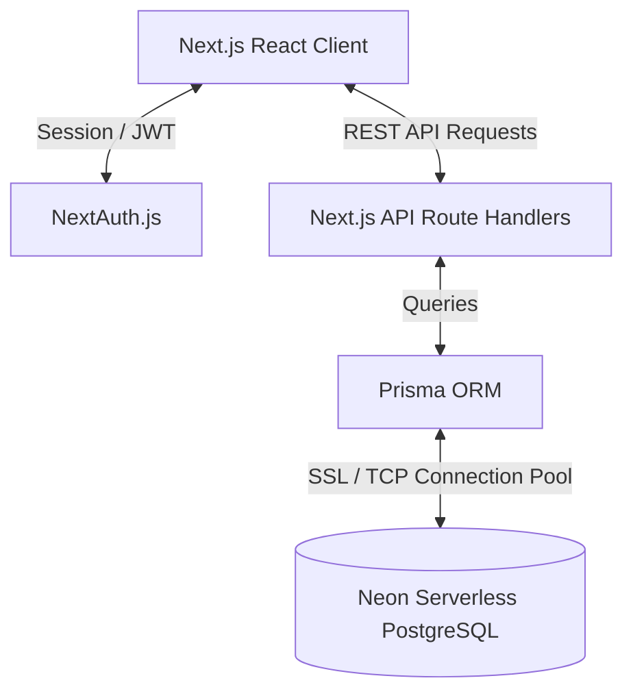
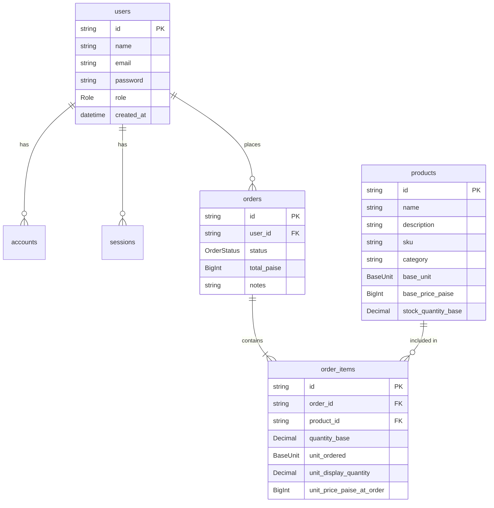

# AasaMedChem Inventory & Order Management System

A robust, full-stack inventory and order management application featuring dynamic unit conversion, real-time stock tracking, role-based navigation, and high-precision price and quantity arithmetic. Designed specifically for handling chemical and pharmaceutical products where precise measurement scaling (e.g., grams to kilograms, milliliters to liters) is paramount.

---

## 🚀 Tech Stack

The application is built using a modern, type-safe web architecture:

- **Frontend & Backend Framework**: [Next.js 14](https://nextjs.org/) (App Router)
- **Database Hosting**: [Neon PostgreSQL](https://neon.tech/) (Serverless Postgres)
- **Object-Relational Mapping (ORM)**: [Prisma](https://www.prisma.io/)
- **Authentication**: [NextAuth.js](https://next-auth.js.org/) (JWT-based credentials provider)
- **Styling**: [Tailwind CSS](https://tailwindcss.com/)
- **Hosting & Deployment**: [Vercel](https://vercel.com/)

---

## 🏗️ System Design



### 1. Unified Next.js Project Structure
Both frontend pages (React Server/Client Components) and backend endpoints (Next.js Route Handlers) live within the same repository. Next.js handles server-side rendering, routing, and compilation under a single runtime. Client components communicate with standard Next.js backend API routes (`/api/*`) via JSON requests.

### 2. Database Connectivity via Prisma & Neon
Prisma connects to Neon serverless PostgreSQL using connection pooling. Database queries are executed within Next.js Server Components or API Route Handlers. Prisma Client handles connection management, connection pooling, and generation of TS types derived directly from the SQL schema.

### 3. Session & Authentication with NextAuth.js
Authentication is managed via NextAuth.js using the **Credentials Provider**. Upon successful login, NextAuth generates a secure, encrypted **JSON Web Token (JWT)** stored in the user's cookies. This JWT contains session information (user ID, name, email, and role) and is verified on both the client (via middleware and contexts) and backend APIs (via `getServerSession()`) to restrict page access and API operations based on user privileges.

---

## 🗄️ Database Schema & Data Integrity

The PostgreSQL database enforces relational schema integrity. Special consideration is given to how prices and quantities are stored to eliminate floating-point precision issues.



### 1. Database Tables

- **`users`**: Stores user authentication credentials, emails, and roles (`ADMIN` vs. `SELLER`).
- **`products`**: Stores inventory records, including SKU, category, base unit, base price, and current stock level.
- **`orders`**: Tracks purchases made by sellers, total cost, and execution status (`PENDING`, `CONFIRMED`, etc.).
- **`order_items`**: Relational join table containing itemized list information, historical snapshots of prices, and ordered amounts.
- **`accounts` / `sessions` / `verification_tokens`**: NextAuth.js metadata tables.

### 2. High-Precision Storage Strategy

#### Why `BigInt` for Prices?
Floating-point arithmetic in JavaScript and SQL is notoriously prone to rounding errors (e.g., `0.1 + 0.2 === 0.30000000000000004`). To prevent financial discrepancies, all monetary values are multiplied by 100 and stored as integer paise (INR × 100) using the PostgreSQL `BIGINT` (Prisma `BigInt`) data type. This guarantees absolute arithmetic accuracy.

#### Why `Decimal(12, 3)` (or `Decimal(20, 6)`) for Quantities?
Chemical inventories involve fractional weights and volumes (e.g., weighing out `0.005` kilograms or `5` grams). Storing quantities as floating-point numbers results in truncation errors. Using PostgreSQL's arbitrary-precision `DECIMAL` (or `NUMERIC`) column constraints ensures quantities are saved with exact decimal accuracy.

#### Enums
- **`Role`**: Enforces user access levels (`ADMIN` | `SELLER`).
- **`BaseUnit`**: Strict database boundary for inventory measurements (`GRAM` | `MILLILITER` | `ITEM`).
- **`OrderStatus`**: Tracks the workflow of a purchase order (`PENDING`, `CONFIRMED`, `PROCESSING`, `SHIPPED`, `DELIVERED`, `CANCELLED`).

---

## ⚖️ Unit Storage & Conversion Strategy

The system handles arbitrary ordering units (e.g., a user buying 1.5 kg of a product whose base unit is grams) using a centralized conversion utility, [units.ts](file:///e:/Hackathon-assignment/inventory-app/src/lib/units.ts).

```
   Form (User Display)            API Route Handler             Database Storage
=========================     ========================     ==========================
"1.5 kg" (Kilograms)          ──►  toBaseUnit()  ──►        1500 (Grams as Decimal)
"₹1,499.00" (INR)             ──►  toPaise()     ──►        149900 (Paise as BigInt)
"1.5 L" (Liters)              ──►  toBaseUnit()  ──►        1500 (Milliliters as Decimal)
```

### 1. Base Units Reference
All items inside the database are strictly normalized to base units:
- **Weights**: Grams (`GRAM`)
- **Volumes**: Milliliters (`MILLILITER`)
- **Counts**: Individual units (`ITEM`)

### 2. Conversion Multipliers
- **Weight**: `1 kg` = `1000 g`
- **Volume**: `1 L` = `1000 mL`
- **Count**: `1 item` = `1 item`

### 3. How and Where Conversion Occurs
- **Input (Write Path)**: Done inside the API endpoint controller *before* writing to Postgres. Users enter values in kilograms, grams, liters, milliliters, or items. The controller invokes `toBaseUnit()` to standardize it and saves the normalized base-unit value.
- **Output (Read Path)**: Done inside client views or formatting utilities *before* rendering. The code reads the base unit amount, determines the most readable presentation unit (e.g., formatting `2500g` to `2.5 kg`), and runs `formatQuantity()` / `formatPriceINR()`.

---

## 🛠️ Local Development Setup

To run the application locally, follow these instructions:

### 1. Clone the Repository
```bash
git clone <repository-url>
cd inventory-app
```

### 2. Install Dependencies
```bash
npm install
```

### 3. Configure Environment Variables
Create a file named `.env.local` in the root of the `inventory-app` directory and populate it:

```env
# Neon PostgreSQL Connection URI
DATABASE_URL="postgresql://[username]:[password]@[neon-host]/[dbname]?sslmode=require"

# NextAuth Configuration
NEXTAUTH_SECRET="your-super-secure-nextauth-jwt-secret-key"
NEXTAUTH_URL="http://localhost:3000"
```

### 4. Push Database Schema to Neon
Synchronize your database instance schema with the Prisma schema definition:
```bash
npx prisma db push
```

### 5. Run Database Seeding
Populate your database with the pre-configured mock users (Admin/Seller) and initial products:
```bash
npx prisma db seed
```

### 6. Launch Dev Server
Start the development server:
```bash
npm run dev
```
Open [http://localhost:3000](http://localhost:3000) in your web browser.

---

## 🚀 Vercel Deployment

To deploy this application live on Vercel:

1. **Push Code to GitHub**: Create a repository and push your project code.
2. **Connect to Vercel**:
   - Go to [vercel.com](https://vercel.com/) and click **Add New** -> **Project**.
   - Import your GitHub repository.
3. **Configure Settings**:
   - Framework Preset: `Next.js`.
   - Root Directory: `inventory-app`.
4. **Define Environment Variables**: Add your production keys in Vercel's dashboard environment settings:
   - `DATABASE_URL`
   - `NEXTAUTH_SECRET`
   - `NEXTAUTH_URL` (Set this to your custom Vercel domain URL)
5. **Deploy**: Click **Deploy**. Vercel will build the frontend, optimize serverless API routes, and deploy the application.

---

## 🔑 Test Credentials

Use these seeded accounts to log in:

### 1. Admin Account (Full Management)
- **Email**: `admin@test.com`
- **Password**: `admin123`
- **Role**: `ADMIN`
- **Privileges**: Create/edit/delete products, manage inventory stock, view all seller orders, and update order statuses.

### 2. Seller Account (Order & Purchase)
- **Email**: `seller@test.com`
- **Password**: `seller123`
- **Role**: `SELLER`
- **Privileges**: Browse products, view live stock availability, place quotes in different units, and track past order status.

---

## 📖 How to Use the Application

### Admin Panel Workflow
1. **Log in** with the Admin credentials.
2. **Dashboard**: View system overview cards showing total products, pending orders, and total revenue.
3. **Product Inventory**:
   - Navigate to `/admin/products`.
   - Click **Add Product** to create a product. You can input prices in INR and set the base unit.
   - Edit pricing, description, and base stock levels directly on existing entries.
   - Safely delete items using the delete trigger.
4. **Order Dispatch**:
   - Navigate to `/admin/orders`.
   - View orders placed by sellers. Click on an order to expand it and review the item breakdown.
   - Check the **Unit Conversion Audit Info** (e.g. shows both the original ordered quantity e.g., "500 g" and its exact base equivalent).
   - Change order statuses from `PENDING` to `CONFIRMED` or `COMPLETED`.

### Seller Panel Workflow
1. **Log in** with the Seller credentials.
2. **Browse Products**:
   - Navigate to `/dashboard/products`.
   - Search for products using the search bar, or filter by category and compatible unit types.
   - Adjust ordering units (e.g., order in `kg` or `g` dynamically). The pricing will adjust on-the-fly based on selected unit and quantity.
3. **Place Orders**:
   - Configure your quantities and units, then click **Add to Quote**.
   - Open your Order Cart, review the total price calculation, and click **Submit Order**.
4. **Track Orders**:
   - Navigate to `/dashboard/orders`.
   - Monitor status updates on all orders placed (from `PENDING` to `COMPLETED` as marked by the admin).
